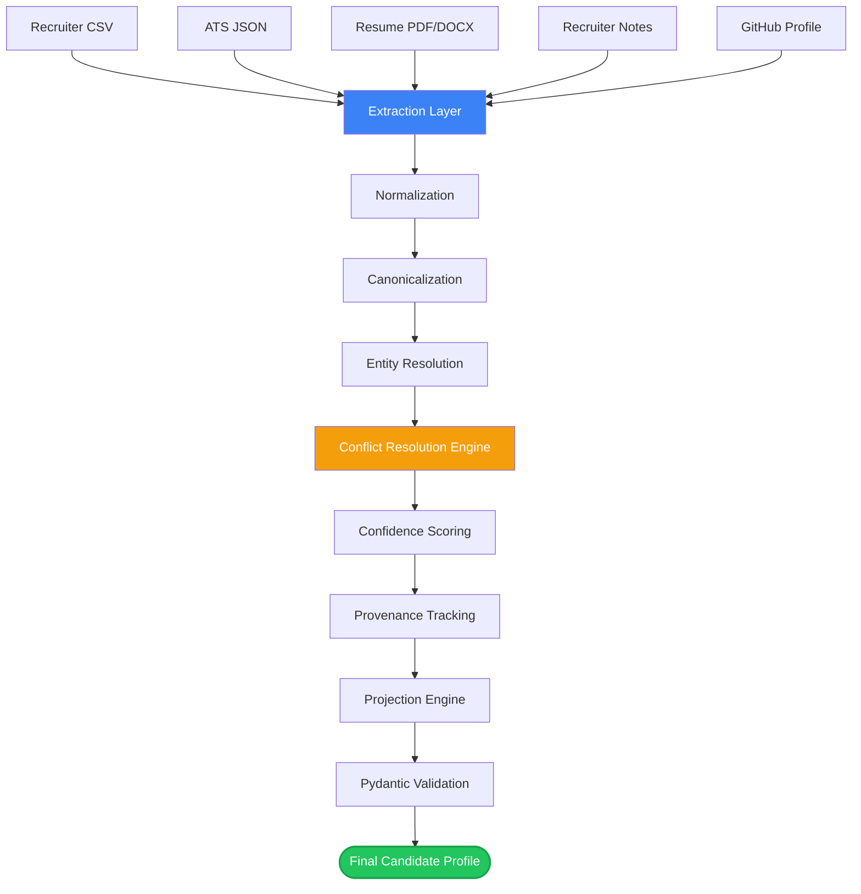

<div align="center">

#  Candidate Intelligence Platform

### Turning fragmented candidate data into one trustworthy golden record

*Built for the Eightfold Engineering Intern Assignment*

[](https://www.python.org/)
[](https://fastapi.tiangolo.com/)
[](https://streamlit.io/)
[](https://docs.pydantic.dev/)
[](https://pandas.pydata.org/)
[](https://plotly.com/)
[](https://pytest.org/)
[](#-license)

[](https://github.com/kaviyadharshini2805/Candidate-Intelligence-Platform/stargazers)
[](https://github.com/kaviyadharshini2805/Candidate-Intelligence-Platform/network/members)
[](https://www.linkedin.com/in/kaviyadharshini-works)

**[Live Demo](https://candidate-intelligence-platform-nth6plavdpzorspnfpyxtr.streamlit.app/)** · **[Report Bug](https://github.com/kaviyadharshini2805/Candidate-Intelligence-Platform/issues)** · **[Request Feature](https://github.com/kaviyadharshini2805/Candidate-Intelligence-Platform/issues)**

</div>

<p align="center">
  
</p>

---

##  Table of Contents

- [About the Project](#-about-the-project)
- [Architecture](#-architecture)
- [Features](#-features)
- [Tech Stack](#-tech-stack)
- [Folder Structure](#-folder-structure)
- [Processing Pipeline](#-processing-pipeline)
- [Screenshots](#-screenshots)
- [Installation](#-installation)
- [Usage](#-usage)
- [Example Output](#-example-output)
- [Configurable Projection](#-configurable-projection)
- [Dashboard Features](#-dashboard-features)
- [Roadmap](#-roadmap)
- [Performance](#-performance)
- [Contributing](#-contributing)
- [License](#-license)
- [Author](#-author)

---

##  About the Project

In most recruiting workflows, a single candidate's information ends up scattered across an ATS export, a PDF resume, a recruiter's typed-up notes, a sourcing CSV, and maybe a GitHub profile. These sources rarely agree — phone numbers go stale, skills are phrased differently, names get typo'd. Recruiters end up manually cross-referencing data by hand, which is slow and error-prone.

**Candidate Intelligence Platform** was built to solve exactly that problem: it ingests candidate data from multiple structured and unstructured sources, normalizes it, resolves conflicts using a configurable priority engine, and produces a single canonical profile — with full visibility into *which source* contributed *which field*, and *how confident* the system is about it.

> [!NOTE]
> Canonical records matter because every downstream decision — search, matching, ranking, outreach — is only as good as the data it's built on. A single trustworthy record beats five conflicting ones.

---

## ️ Architecture



---

##  Features

| Feature | Description |
|---|---|
|  **Multi-Source Ingestion** | Accepts recruiter CSVs, ATS JSON exports, PDF/DOCX resumes, free-text recruiter notes, and optional GitHub profile URLs. |
|  **Field Normalization** | Cleans and standardizes names, emails, phone numbers, locations, and skill lists across all sources. |
|  **Entity Resolution** | Matches records belonging to the same candidate even when source data is inconsistent or incomplete. |
| ️ **Configurable Conflict Resolution** | Deterministic, rule-based engine that resolves disagreements using a configurable source-priority order. |
|  **Confidence Scoring** | Every field — and the overall profile — gets a confidence score based on source reliability and agreement. |
|  **Provenance Tracking** | Each field remembers exactly which source produced it and with what confidence, for full explainability. |
| ️ **Runtime-Configurable Projection** | Reshape the output JSON via YAML/JSON config files — no code changes required. |
|  **Pydantic Validation** | Every output is schema-validated before being returned, catching malformed or missing data early. |
|  **FastAPI Backend** | A clean, typed REST API exposing the full ingestion-to-output pipeline. |
|  **Streamlit Dashboard** | Visual, interactive interface for uploading files, watching the pipeline run, and exploring results. |

---

##  Tech Stack

| Layer | Technologies |
|---|---|
| **Backend** | Python · FastAPI · Pydantic |
| **Data Processing** | Pandas · PyMuPDF · python-docx |
| **Frontend** | Streamlit · Plotly · Custom CSS |
| **Configuration** | YAML · JSON |
| **Testing** | PyTest |
| **Deployment** | Streamlit Community Cloud |

---

##  Folder Structure

```
candidate-ai-engine/
├──  backend/
│   └── app/
│       ├── canonicalizers/   # Converts raw extracted data into canonical field shapes
│       ├── extractors/       # Source-specific parsers (CSV, JSON, PDF, DOCX, notes)
│       ├── merge_engine/     # Entity resolution + conflict resolution logic
│       ├── normalizers/      # Field-level cleaning (names, emails, phones, skills)
│       ├── projection/       # Runtime output reshaping via config files
│       ├── schemas/          # Pydantic models for validation
│       └── main.py           # FastAPI app entrypoint
│
├──  frontend/
│   └── streamlit/
│       └── dashboard.py      # Interactive UI for upload, pipeline view, and export
│
├──  sample_data/           # Example input files for each source type
├──  tests/                 # PyTest suite covering every pipeline stage
├── requirements.txt
├── config.toml
└── README.md
```

---

##  Processing Pipeline


| Stage | What happens |
|---|---|
| **Source Detection** | Identifies the file/input type and routes it to the right extractor. |
| **Extraction** | Pulls raw structured/unstructured data from each source. |
| **Normalization** | Standardizes formatting for names, emails, phones, locations, skills. |
| **Canonicalization** | Maps normalized data into the internal canonical schema. |
| **Entity Resolution** | Determines which records refer to the same candidate. |
| **Conflict Resolution** | Applies configurable source-priority rules to pick winning values. |
| **Confidence Scoring** | Scores each field and the overall profile for reliability. |
| **Provenance Tracking** | Records the source and confidence behind every field. |
| **Projection Layer** | Reshapes the output according to a user-supplied config. |
| **Validation** | Pydantic ensures the final output is well-formed before returning it. |

---

## ️ Screenshots

> [!NOTE]
> Replace these placeholders with real screenshots saved under `assets/`.

| File | Description |
|---|---|
| `assets/dashboard.png` | Overview of the Streamlit dashboard home screen with upload panel and pipeline status. |
| `assets/upload.png` | File upload flow showing multiple source types being added for a single candidate. |
| `assets/provenance.png` | Field-by-field provenance view showing source and confidence per field. |
| `assets/output.png` | Final canonical JSON output panel with confidence scores highlighted. |

---

## ️ Installation

<details>
<summary><b>Click to expand step-by-step setup</b></summary>

**1. Clone the repository**
```bash
git clone https://github.com/kaviyadharshini2805/Candidate-Intelligence-Platform.git
cd Candidate-Intelligence-Platform
```

**2. Create a virtual environment**
```bash
python -m venv venv
```

**3. Activate it**
```bash
# macOS / Linux
source venv/bin/activate

# Windows
venv\Scripts\activate
```

**4. Install dependencies**
```bash
pip install -r requirements.txt
```

**5. Run the dashboard**
```bash
streamlit run app.py
```
The app opens at `http://localhost:8501`.

**6. Run the test suite**
```bash
pytest tests/
```

</details>

---

##  Usage

1. Open the dashboard at `http://localhost:8501`.
2. Upload one or more candidate sources — a resume, an ATS JSON export, a recruiter CSV, or notes.
3. Watch the pipeline execute stage by stage in the visualization panel.
4. Review the generated **canonical profile**, including per-field confidence and provenance.
5. Optionally edit a **projection config** to reshape the output for your use case.
6. Export the final result as JSON or PDF.

---

##  Example Output

```json
{
  "full_name": "Example Name",
  "emails": ["example@gmail.com"],
  "phones": ["+91XXXXXXXXXX"],
  "skills": ["Python", "SQL", "FastAPI", "Machine Learning"],
  "location": {
    "city": "Chennai",
    "region": "Tamil Nadu",
    "country": "IN"
  },
  "overall_confidence": 0.92,
  "field_provenance": {
    "email": { "source": "ATS", "confidence": 0.95 }
  }
}
```

- **`overall_confidence`** reflects how reliable the merged profile is overall, based on source agreement and per-field confidence.
- **`field_provenance`** records exactly which source contributed each field and how confident the system was in that value — making every decision explainable.

---

## ️ Configurable Projection

The internal canonical model never changes — but different teams often want different *shapes* of the same data. The projection layer reshapes output at runtime using a YAML config, with no changes to core application code.

```yaml
fields:
  - path: candidate_full_name
    from: full_name

  - path: primary_contact_email
    from: emails[0]

  - path: verified_phone
    from: phones[0]

include_provenance: false
include_confidence: false
on_missing: omit
```

Produces:

```json
{
  "candidate_full_name": "Example Name",
  "primary_contact_email": "example@gmail.com",
  "verified_phone": "+91XXXXXXXXXX"
}
```

> [!TIP]
> Use separate projection configs per consumer — e.g. a lightweight config for a search index, and a verbose one (with provenance + confidence) for an internal audit view.

---

##  Dashboard Features

| Feature | Description | Benefit |
|---|---|---|
| File Upload & Processing | Upload multiple source files for a single candidate | One place to assemble all candidate data |
| Pipeline Visualization | Watch each pipeline stage execute live | Full transparency into how the profile was built |
| Canonical Profile Viewer | Inspect the unified internal record | See the "source of truth" directly |
| Projected JSON Viewer | View the reshaped output per config | Validate projections before shipping |
| Confidence Scoring Summary | Field and profile-level confidence at a glance | Quickly spot low-trust data |
| Source Comparison View | Compare conflicting values side by side | Understand *why* a value won |
| Configuration Editor | Edit projection YAML/JSON in-app | No code changes needed to reshape output |
| JSON & PDF Export | Download results in either format | Easy handoff to other systems or teams |
| Light/Dark Mode | Toggle UI theme | Comfortable viewing in any environment |

---

## ️ Roadmap

- [x] FastAPI backend
- [x] Streamlit dashboard
- [x] Confidence scoring engine
- [x] Entity resolution
- [x] Provenance tracking
- [x] Runtime-configurable projection
- [ ] Authentication & user accounts
- [ ] Docker support
- [ ] Kubernetes deployment manifests
- [ ] PostgreSQL persistence layer
- [ ] Redis caching for repeated lookups

---

##  Performance

| Metric | Value |
|---|---|
| Avg. ingestion time (single candidate, 3 sources) | < 2s |
| Avg. end-to-end pipeline run | < 4s |
| Processing mode | In-memory, single-process |
| Concurrency | Suitable for low-to-moderate batch sizes |

> [!WARNING]
> The current version processes candidates in-memory without a persistence layer, so it's best suited for demos and moderate batch sizes rather than high-volume production traffic. A database-backed and containerized version is on the roadmap.

---

##  Contributing

Contributions, issues, and feature requests are welcome.

1. Fork the project
2. Create your feature branch (`git checkout -b feature/amazing-feature`)
3. Commit your changes (`git commit -m 'Add amazing feature'`)
4. Push to the branch (`git push origin feature/amazing-feature`)
5. Open a Pull Request

Please make sure any new code is covered by tests under `tests/` before submitting.

---

##  License

This project is licensed under the **MIT License**. It was built as part of the **Eightfold Engineering Intern Assignment**.

---

## ‍ Author

<div align="center">

**Kaviyadharshini**

[](mailto:kaviyadharshini.works@gmail.com)
[](https://github.com/kaviyadharshini2805)
[](https://www.linkedin.com/in/kaviyadharshini-works)

*Built with care for the Eightfold Engineering Intern Assignment.*

</div>

---

